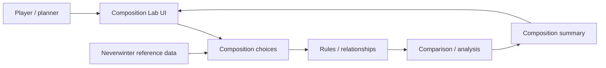
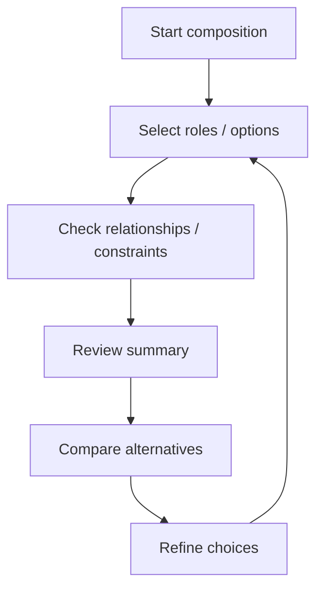
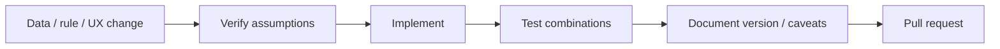

<div align="center">

# Neverwinter Composition Lab

**A Neverwinter planning and experimentation project for exploring party/build composition, relationships, and comparison workflows in a structured interface.**


[Browse source](https://github.com/Nischhalsubba/neverwinter-composition-lab/tree/main) · [Issues](https://github.com/Nischhalsubba/neverwinter-composition-lab/issues)

</div>

## Overview

**Neverwinter Composition Lab** is documented as an experimentation tool: choose composition inputs, apply the project's rules/data, compare the resulting configuration, and iterate. Version-sensitive game facts should remain distinguishable from assumptions or exploratory ideas.

<details open>
<summary><strong>🏗️ Interactive composition architecture</strong></summary>



</details>

## Planning flow



## Audience guide

| Audience | Focus |
|---|---|
| Players | Explore composition choices and comparisons |
| Developers | Data, rules, state, calculations and tests |
| Designers | Dense selection/comparison UX and responsive states |
| Maintainers | Game version, provenance and rule accuracy |

## Getting started

```bash
git clone https://github.com/Nischhalsubba/neverwinter-composition-lab.git
cd neverwinter-composition-lab
```

Use the manifests and lockfiles in the repository to determine current development commands.

## Design & data principles

Make dependencies visible, explain invalid or incompatible choices, preserve source/version context, allow easy iteration, and keep comparison output readable enough that players can understand *why* two compositions differ.

## SEO & discoverability

Use terms such as **Neverwinter composition, party composition, Neverwinter planner, build comparison, team roles, and Neverwinter tools** only when those concepts are actually implemented and supported by verified data.

## Contribution flow


