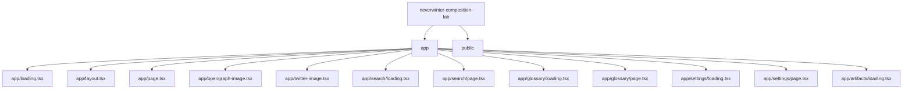
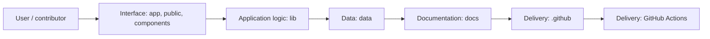
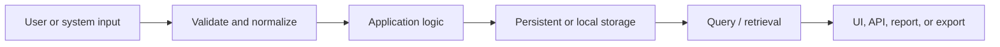
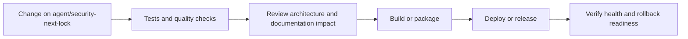
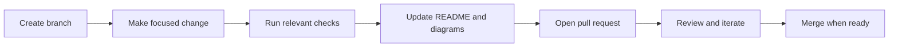
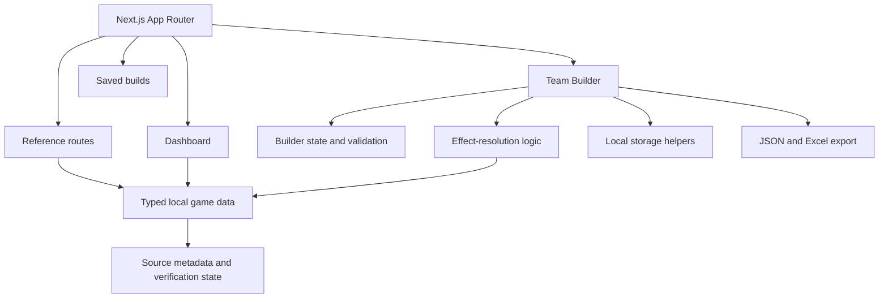

<!-- interactive-readme-standard:start -->

<div align="center">

# neverwinter-composition-lab

**Branch-aware technical guide for [`agent/security-next-lock`](https://github.com/Nischhalsubba/neverwinter-composition-lab/tree/agent/security-next-lock)**

<p>       </p>

<p>
  <a href="https://github.com/Nischhalsubba/neverwinter-composition-lab/tree/agent/security-next-lock"><strong>Browse source</strong></a> ·
  <a href="https://github.com/Nischhalsubba/neverwinter-composition-lab/issues"><strong>Issues</strong></a> ·
  <a href="https://github.com/Nischhalsubba/neverwinter-composition-lab/codespaces/new?ref=agent%2Fsecurity-next-lock"><strong>Open in Codespaces</strong></a>
</p>

</div>

> [!IMPORTANT]
> This guide is generated from the files actually present on `agent/security-next-lock`. It links to detected source paths, preserves project-authored notes, and avoids claiming components that were not found.

## At a glance

| Item | Detected value |
|---|---|
| Purpose | A Next.js and TypeScript team-composition planner, reference hub, buff/debuff coverage tool, saved-build manager, JSON import/export workflow, and Excel workbook exporter for Neverwinter endgame group planning. |
| Branch role | Compared with `main` |
| Stack | Next.js, React, Tailwind CSS, TypeScript, HTML, JavaScript, CSS |
| Manifests | package.json |
| Prerequisites | Node.js |
| Delivery | GitHub Actions |
| License | No license file detected |

## Branch scope

This branch differs from the default branch in the following detected paths:

- [`README.md`](https://github.com/Nischhalsubba/neverwinter-composition-lab/blob/agent/security-next-lock/README.md)

## Quick start

```bash
npm install
npm run dev
npm run start
npm run build
npm run lint
```

### Configuration surface

- No committed environment example file was detected.

> Never commit secrets, private keys, production credentials, customer data, or unredacted infrastructure details.

## Repository map

```mermaid
flowchart TD
    ROOT["neverwinter-composition-lab / agent/security-next-lock"]
    ROOT --> P0[".github/"]
    ROOT --> P1["app/"]
    ROOT --> P2["components/"]
    ROOT --> P3["config/"]
    ROOT --> P4["data/"]
    ROOT --> P5["docs/"]
    ROOT --> P6["features/"]
    ROOT --> P7["lib/"]
    ROOT --> P8["public/"]
    ROOT --> P9[".gitignore"]
    ROOT --> P10["AGENTS.md"]
    ROOT --> P11["CLAUDE.md"]
    ROOT --> P12["eslint.config.mjs"]
    ROOT --> P13["neverwinter_final_ai_master_context.md"]
    ROOT --> P14["neverwinter_frontend_design_spec.md"]
    ROOT --> P15["neverwinter_source_registry_and_proof.md"]
    ROOT --> P16["next.config.ts"]
    ROOT --> P17["package-lock.json"]
    ROOT --> MORE["+ 18 more top-level entries"]
```



| Responsibility | Detected source paths |
|---|---|
| Interface | [`app`](https://github.com/Nischhalsubba/neverwinter-composition-lab/tree/agent/security-next-lock/app), [`public`](https://github.com/Nischhalsubba/neverwinter-composition-lab/tree/agent/security-next-lock/public), [`components`](https://github.com/Nischhalsubba/neverwinter-composition-lab/tree/agent/security-next-lock/components) |
| Application logic | [`lib`](https://github.com/Nischhalsubba/neverwinter-composition-lab/tree/agent/security-next-lock/lib) |
| Data | [`data`](https://github.com/Nischhalsubba/neverwinter-composition-lab/tree/agent/security-next-lock/data) |
| Documentation | [`docs`](https://github.com/Nischhalsubba/neverwinter-composition-lab/tree/agent/security-next-lock/docs) |
| Delivery | [`.github`](https://github.com/Nischhalsubba/neverwinter-composition-lab/tree/agent/security-next-lock/.github) |

## Website or application map



## Architecture and responsibility flow



<details>
<summary><strong>Data flow and model surface</strong></summary>



Detected data areas: [`data`](https://github.com/Nischhalsubba/neverwinter-composition-lab/tree/agent/security-next-lock/data).

</details>

## Quality, security, and operations

<table>
<tr>
<td width="33%" valign="top">

### Quality

- No conventional test directory was detected automatically.

Detected commands:
- `npm run dev`
- `npm run start`
- `npm run build`
- `npm run lint`
- `npm run typecheck`

</td>
<td width="33%" valign="top">

### Security

- No dedicated security policy or automated dependency configuration was detected.

Review authentication, authorization, input validation, dependency updates, secret handling, and failure recovery before release.

</td>
<td width="34%" valign="top">

### Observability

- No dedicated observability integration was detected automatically.

Define useful logs, metrics, traces, alerts, and rollback signals for production-facing branches.

</td>
</tr>
</table>

## Delivery flow



### Automation detected

- [`.github/workflows/apply-interactive-readme.yml`](https://github.com/Nischhalsubba/neverwinter-composition-lab/blob/agent/security-next-lock/.github/workflows/apply-interactive-readme.yml)

## Contribution flow



- Keep changes focused and explain architectural consequences.
- Run the checks relevant to the changed area.
- Update diagrams whenever routes, modules, data models, authentication, jobs, or delivery paths change.
- Add screenshots or recordings for visual behavior changes when useful.
- Use issues for reproducible defects and pull requests for reviewable changes.

## Ownership and support

| Topic | Source |
|---|---|
| Repository | [`Nischhalsubba/neverwinter-composition-lab`](https://github.com/Nischhalsubba/neverwinter-composition-lab) |
| Branch | [`agent/security-next-lock`](https://github.com/Nischhalsubba/neverwinter-composition-lab/tree/agent/security-next-lock) |
| Ownership | No CODEOWNERS file detected |
| Contributing | Use the contribution flow above |
| Support | [Open or review issues](https://github.com/Nischhalsubba/neverwinter-composition-lab/issues) |
| License | No license file detected |

<details>
<summary><strong>Documentation maintenance checklist</strong></summary>

- [ ] Purpose and branch scope are accurate.
- [ ] Setup and configuration commands still work.
- [ ] Repository, application, API, data, authentication, job, and deployment diagrams match the code.
- [ ] Tests, security controls, observability, and rollback behavior are documented.
- [ ] Links point to real files on this branch.
- [ ] No secrets or private operational details are exposed.

</details>

<!-- interactive-readme-standard:end -->

<!-- project-authored-notes:start -->
<details>
<summary><strong>Project-authored notes preserved from this branch</strong></summary>

<div align="center">


# Neverwinter Composition Lab

### A patch-aware team builder, support planner, buff/debuff calculator, reference hub, and export tool for Neverwinter endgame groups.

<p>
  
  
  
  
  
</p>

[Live app](https://neverwinter-composition-lab.vercel.app/) · [Overview](#overview) · [Features](#features) · [Builder logic](#builder-logic) · [Architecture](#architecture) · [Data model](#data-and-provenance) · [Setup](#getting-started) · [Roadmap](#roadmap)

</div>

---

> [!NOTE]
> This repository is an active planning prototype. It already contains a real Next.js application, typed local game data, route-based reference pages, team-building logic, saved builds, JSON import/export, Excel export, and dynamic social-preview generation. Neverwinter values still need patch-aware verification before competitive use.

## Overview

**Neverwinter Composition Lab** is a web application for planning optimized dungeon and trial groups in the MMORPG Neverwinter.

The product is built around a practical question: **what combination of roles, classes, paragons, artifacts, companions, enhancements, mount powers, buffs, and debuffs creates the strongest team for a specific activity?**

Instead of treating the answer as a static spreadsheet, the application provides an editable planning surface with visible role rules, source-aware game data, ranked recommendations, export tools, and reference pages that support the main builder workflow.

### What the product helps users do

- Build five-player dungeon parties.
- Build ten-player trial compositions.
- Switch between standard trial and MSOD role shells.
- Assign tank, healer, DPS, support, and carry responsibilities.
- Select classes and paragon paths.
- Plan artifacts, companions, companion enhancements, mount powers, and power loadouts.
- Track team buffs and enemy debuffs without hiding effect categories inside one unexplained score.
- Save builds locally.
- Export and import builds as JSON.
- Export structured workbooks with ExcelJS.
- Use ranked reference data while planning.
- Keep uncertain or incomplete values visibly marked rather than pretending they are verified.

## Why it exists

Neverwinter group optimization is usually distributed across:

- spreadsheets
- screenshots
- Discord messages
- community rankings
- patch notes
- wikis
- player memory
- copied loadouts

That creates several problems:

- duplicate buffs and debuffs are easy to miss
- role coverage can be unclear
- outdated values look authoritative
- sources disappear from copied notes
- planning a carry-focused team differs from maximizing total team damage
- party leaders need quick decisions, not another giant table

Composition Lab turns that fragmented process into one typed, visual, patch-aware planning workflow.

## Features

<table>
  <tr>
    <td width="50%" valign="top">
      <h3>Team Builder</h3>
      <p>Build dungeon and trial groups, select roles, assign classes and paragons, configure loadouts, choose a carry target, validate the role split, and export the result.</p>
    </td>
    <td width="50%" valign="top">
      <h3>Buff and debuff coverage</h3>
      <p>Track incoming-damage effects, defense reduction, awareness reduction, vulnerabilities, offensive ratings, and other effect families without flattening them into one opaque score.</p>
    </td>
  </tr>
  <tr>
    <td width="50%" valign="top">
      <h3>Reference Hub</h3>
      <p>Browse classes, paragons, artifacts, companions, enhancements, mounts, buffs, debuffs, glossary terms, and supporting system details.</p>
    </td>
    <td width="50%" valign="top">
      <h3>Build persistence and export</h3>
      <p>Save builds locally, share them through JSON, and generate formatted Excel workbooks for group planning.</p>
    </td>
  </tr>
</table>

### Builder modes

| Mode | Slots | Default shell |
|---|---:|---|
| Dungeon | 5 | 1 tank, 1 healer, 3 DPS |
| Standard trial | 10 | 2 tanks, 2 healers, 6 DPS |
| MSOD trial | 10 | 2 tanks, 3 healers, 5 DPS |

The dashboard can switch between dungeon and trial planning. Trial mode also supports a Standard/MSOD preset switch, and the interface changes its role summary, recommendation context, and slot count accordingly.

### Team Builder capabilities

- Selected-slot editing
- Class and paragon assignment
- Artifact selection
- Companion selection
- Companion enhancement selection
- Mount selection
- Power-loadout editing
- Carry or boost-target designation
- Role-shell validation
- Save, import, and export actions
- Context panels and drawers for active slot details

### Recommendation surfaces

The dashboard exposes ranked planning data such as:

- top debuff artifacts for the selected mode
- top support companions for trials
- single-target companion recommendations for dungeons
- mandatory trial coverage where configured
- high-value companion enhancements
- role-shell notes and warnings

## Builder logic

The application keeps effect types distinct so that the UI can explain **where value comes from**.

Tracked effect families include:

- incoming damage
- defense reduction
- awareness reduction
- critical avoidance reduction
- deflect reduction
- physical vulnerability
- magical vulnerability
- projectile vulnerability
- damage bonus
- power
- critical strike
- critical severity
- combat advantage
- accuracy
- forte

### Planning models

The product supports two different optimization mindsets:

1. **Boost one DPS**
   - Choose a carry target.
   - Evaluate support primarily by how much it improves that player’s output.

2. **Maximize team damage**
   - Evaluate coverage across the entire composition.
   - Avoid duplicate or conflicting effects.
   - Balance personal damage with team contribution.

> [!IMPORTANT]
> The tool should never convert incomplete or uncertain data into a confident recommendation without showing its verification state.

## Key routes

| Route | Purpose |
|---|---|
| `/` | Builder-focused command board with role shells and ranked planning data |
| `/team-builder` | Main party and trial composition workflow |
| `/reference` | Navigation surface for reference content |
| `/classes` | Classes and paragon paths |
| `/artifacts` | Artifact reference and recommendations |
| `/companions` | Companion reference and rankings |
| `/mounts` | Mount-related planning data |
| `/buffs-debuffs` | Effect library and coverage reference |
| `/saved-builds` | Locally saved team compositions |
| `/settings` | Product settings and preferences |

## Architecture



### Frontend layers

```text
app/                    Next.js App Router pages, layouts, metadata, and social images
components/             Shared UI primitives, shell, loading states, and motion
features/team-builder/  Core composition-builder workflow
features/               Product-specific feature modules
components/motion/      Reveal, stagger, and route transition utilities
data/                   Typed game entities, rankings, and imported snapshots
lib/                    Effect math, validation, storage, export, and utilities
docs/                   Product context, source registry, design notes, and change history
```

### Technology stack

| Layer | Technology | Role |
|---|---|---|
| Framework | Next.js `16.2.2` | App Router, layouts, metadata, routes, and production build |
| UI runtime | React `19.2.4` | Interactive planning state and components |
| Language | TypeScript | Typed game entities, builder state, and effect logic |
| Styling | Tailwind CSS `4` | Layout, spacing, responsive states, and visual system |
| Motion | GSAP | Controlled panel and route animation |
| Export | ExcelJS | Formatted workbook generation |
| Icons | Lucide React | Interface iconography |
| Variants | class-variance-authority | Component variants |
| Class utilities | clsx + tailwind-merge | Conditional styling and class conflict resolution |

## Data and provenance

The application currently uses **typed local data**, not a live backend.

Data is derived from curated and imported sources such as:

- NW-Hub content
- community ranking sheets
- Google Sheets exports
- local source snapshots
- internal documentation in `docs/`
- recovered image and ranking data

### Provenance rules

Meaningful entities should preserve fields such as:

- `id`
- `name`
- `source_url`
- `source_type`
- `source_version`
- `verification_status`
- `notes`

### Verification states

The data model should distinguish at least:

- verified
- partially verified
- inferred
- unresolved
- deprecated or patch-stale

This is essential because game balance changes, community sources disagree, and copied values age faster than players admit.

## Design system

The product deliberately avoids the visual language of a fantasy wiki.

### Interface direction

- planning-first
- technical
- calm
- editorial
- high contrast
- low visual noise
- obvious active, selected, hover, and disabled states
- responsive across desktop, tablet, and mobile

### Core palette

| Token | Value |
|---|---|
| Deep navy | `#03045E` |
| Strong blue | `#0077B6` |
| Cyan | `#00B4D8` |
| Light cyan | `#90E0EF` |
| Pale surface | `#CAF0F8` |

### Product layout

- Left: stable navigation and orientation
- Center: primary planning workflow
- Right: selected-slot detail and active context

The dashboard uses a command-board pattern with mode selection, role-shell summaries, builder actions, shortcuts, and ranked recommendations.

## SEO and social preview

The repository includes first-class metadata in `app/layout.tsx`:

- canonical URL
- application name
- search keywords
- Open Graph title and description
- Twitter summary card
- dynamic 1200×630 Open Graph image
- application icons

The README hero uses the application’s own `/opengraph-image` route. That image is generated by the codebase itself rather than being an unrelated mockup.

## Getting started

### Requirements

- Node.js `22+`
- npm `10+`
- repository declares npm `11.6.2`

### Install

```bash
git clone https://github.com/Nischhalsubba/neverwinter-composition-lab.git
cd neverwinter-composition-lab
npm install
```

### Run locally

```bash
npm run dev
```

Open:

```text
http://localhost:3000
```

### Validate the project

```bash
npm run lint
npm run typecheck
npm run build
```

Or run the combined check:

```bash
npm run check
```

### Available scripts

| Command | Purpose |
|---|---|
| `npm run dev` | Start the Next.js development server |
| `npm run build` | Create a production build |
| `npm run start` | Run the production server |
| `npm run lint` | Run ESLint |
| `npm run typecheck` | Run TypeScript without emitting files |
| `npm run check` | Lint, type-check, and build |

## Deployment

The production metadata points to:

```text
https://neverwinter-composition-lab.vercel.app
```

A standard Vercel deployment should use:

```text
Framework preset: Next.js
Build command: npm run build
Output: managed by Next.js/Vercel
```

> [!NOTE]
> The deployment hostname is verified from repository metadata. This execution environment could not resolve the host during the audit, so the README does not claim a fresh runtime screenshot was captured here.

## Testing and QA

### Builder QA

- [ ] Dungeon mode always creates five valid slots.
- [ ] Standard trial mode creates the correct 2/2/6 shell.
- [ ] MSOD mode creates the correct 2/3/5 shell.
- [ ] Carry-target selection remains valid after slot edits.
- [ ] Duplicate artifacts and companions are handled intentionally.
- [ ] Buff and debuff coverage updates when loadouts change.
- [ ] Missing source data remains visibly unresolved.
- [ ] JSON export and import produce equivalent builds.
- [ ] Excel export opens correctly and preserves labels.
- [ ] Saved builds survive a browser refresh.

### UX QA

- [ ] Keyboard focus is visible.
- [ ] Drawers and modals are escapable.
- [ ] Mobile layouts preserve builder context.
- [ ] Loading skeletons match final component shapes.
- [ ] Motion respects reduced-motion preferences.
- [ ] Empty reference categories explain what is missing.
- [ ] Long item names do not break cards or tables.

### Data QA

- [ ] Every recommendation has source metadata.
- [ ] Patch or source version is visible internally.
- [ ] Deprecated values do not silently remain ranked.
- [ ] Verified and inferred data are never merged without labels.
- [ ] Ranking imports are reproducible.
- [ ] Source URLs and notes are reviewed before release.

## Known limitations

- Data is local and curated rather than synchronized with a live game API.
- Community rankings can become stale after balance changes.
- Some effects may remain unresolved or only partially verified.
- A planning score cannot fully model player skill, timing, mechanics, encounter design, or execution.
- Local saves are browser-specific unless exported.
- The builder should not be treated as an official Neverwinter source.

## Roadmap

### Builder

- [ ] Improve effect conflict and overlap warnings.
- [ ] Add more explicit carry-focused versus team-focused scoring.
- [ ] Add clearer role and class constraints.
- [ ] Add build comparison.
- [ ] Add shareable URL-based builds.

### Data

- [ ] Add patch-aware data snapshots.
- [ ] Expand source registry coverage.
- [ ] Add visible verification badges throughout reference pages.
- [ ] Add import validation for ranking sheets.
- [ ] Add change logs for updated values.

### Product

- [ ] Improve mobile builder ergonomics.
- [ ] Add collaborative planning workflows.
- [ ] Add printable and Discord-friendly summaries.
- [ ] Add stronger accessibility coverage.
- [ ] Add automated tests for effect math and export logic.

<details>
<summary><strong>Release checklist</strong></summary>

```bash
npm ci
npm run check
```

Then verify:

1. Dashboard mode switching
2. Standard and MSOD trial presets
3. Dungeon composition
4. Slot editing
5. Carry-target behavior
6. Buff/debuff coverage
7. Saved builds
8. JSON import/export
9. Excel export
10. Open Graph and Twitter images
11. Mobile layout
12. Reduced motion

</details>

## Maintainer

**Nischhal Raj Subba**

Product design, data modeling, frontend implementation, and repository direction.

## Disclaimer

Neverwinter Composition Lab is an independent community project. It is not affiliated with or endorsed by Cryptic Studios, Arc Games, Gearbox Publishing, or the Neverwinter rights holders. Game names, data, and related assets belong to their respective owners.

</details>
<!-- project-authored-notes:end -->
